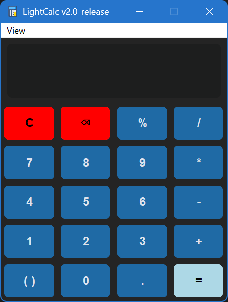
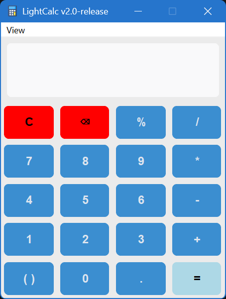

# LightCalc

LightCalc is a small, open-source calculator with keyboard input, expression history, and light, dark, and system themes. It is available as both a browser calculator and a Python desktop application.

## Preview

<p align="center">
  
  
</p>

## Features

- Basic arithmetic, percentages, parentheses, and decimal values.
- Keyboard support for digits, operators, `Enter`, `Backspace`, and `Esc`.
- Light, dark, and system appearance modes.
- Saved theme preference for the desktop application.
- Windows and Linux desktop builds, plus a standalone web version.

## Use the Web Version

Open [LightCalc-web.html](LightCalc-web.html) in a browser, or visit the project website. No installation or build step is required.

## Run the Desktop Version From Source

### Requirements

- Python 3
- Tkinter (`python3-tk` on Debian-based Linux)
- The packages listed in [requirements.txt](LightCalc-source/Calculator/requirements.txt)

Install the dependencies:

```bash
python3 -m pip install -r LightCalc-source/Calculator/requirements.txt
```

Launch LightCalc:

```bash
python3 LightCalc-source/Calculator/LightCalc.pyw
```

On Windows, use `python` instead of `python3` if that is the command provided by your Python installation.

## Build Using Debian App Builder

The project can be packaged with [Debian App Builder](../Debian-App-Builder/). This creates the Debian directory structure, launcher, desktop entry, and final `.deb` package through a graphical workflow.

1. Launch `DebianAppBuilder-source/DebAppBuilder.py` from the Debian App Builder repository.
2. Choose the `LightCalc-source/Calculator/LightCalc.pyw` file, or select the complete `LightCalc-source/Calculator` folder.
3. Enter the package name, version, architecture, dependencies, and maintainer information.
4. Review the generated files and build the package from the **Build** tab.

On Windows, run Debian App Builder from a Debian or Ubuntu WSL distribution. On Linux, use a Debian-based distribution with `dpkg-deb` installed.

## Build a Debian Package Manually

The repository includes a prepared package tree in `LightCalc-source-deb/`. On a Debian-based system, install the packaging tools and build it with:

```bash
sudo apt install dpkg-dev
dpkg-deb --build LightCalc-source-deb
```

For Windows releases, use the packaged release artifacts or build the Python application with your preferred PyInstaller configuration.

## Repository Layout

```text
LightCalc/
├── LightCalc-web.html                  # Browser version
├── script.js                           # Web calculator logic
├── LightCalc-source/Calculator/
│   ├── LightCalc.pyw                   # Desktop application
│   ├── requirements.txt                # Python dependencies
│   └── theme_settings.txt              # Saved desktop theme
├── LightCalc-source-deb/               # Debian package tree
├── images/                              # README preview images
└── download.html                       # Release redirect page
```

## Credits

LightCalc is created and maintained by [tuffgit21](https://github.com/tuffgit21). Please credit the author when redistributing modified versions.
